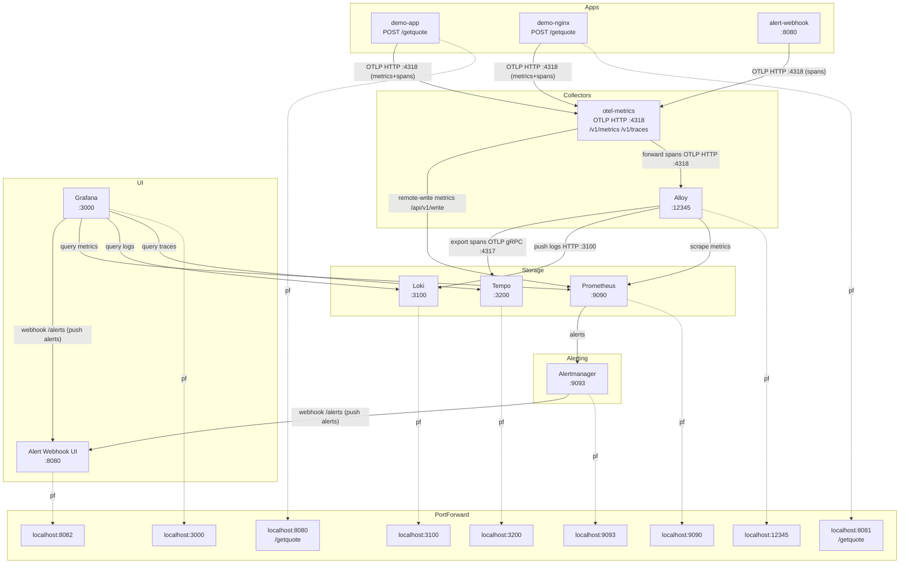

# Local Grafana Monitoring Stack

This stack provides a complete monitoring solution for your Kubernetes cluster, including metrics collection, log aggregation, and visualization.

## Components
- **Grafana**: Visualization and dashboards (pre-provisioned).
- **Prometheus**: Metrics database (with remote-write, persistence, and cluster-wide visibility).
- **Loki**: Log aggregation system (with structured metadata and persistence).
- **Tempo**: Distributed tracing backend (with persistence).
- **Alloy**: Grafana's OpenTelemetry-collector based agent for scraping metrics, logs, and traces.
- **OTel Metrics Gateway**: OTLP receiver for app metrics and traces; remote-writes metrics to Prometheus and forwards traces to Alloy.
- **Alertmanager**: Alert routing and notification fan-out.
- **Alert Webhook**: Lightweight alert history receiver with persistent storage.

## Architecture Diagram


## OpenTelemetry (OTLP)
- **Ingestion**: Apps export OTLP to `otel-metrics.monitoring:4318` (HTTP, use `/v1/metrics` and `/v1/traces`).
- **Traces**: `demo-app`, `demo-nginx`, and `alert-webhook` ship OTLP traces to `otel-metrics`; traces are forwarded to Alloy and then to Tempo.
- **Metrics**: `demo-app` and `demo-nginx` emit OTLP metrics to `otel-metrics`, which remote-writes to Prometheus.
- **Safe rollout**: Prometheus scraping and Loki log collection remain unchanged for other workloads.

## Resource Management & Security

### Resource Limits
All workloads include CPU/memory requests and limits to keep the stack predictable.

### Network Policies
Ingress to Prometheus, Loki, and Tempo is restricted to Alloy and Grafana (Tempo is also allowed to reach Prometheus for remote-write).
Policies are defined in `yaml/network-policy.yaml` and require a CNI that enforces NetworkPolicy.

## Quick Start

### 1. Using the Makefile
The easiest way to manage the stack is using the provided `Makefile`:

```bash
make start          # Creates namespace, applies manifests, starts ALL port-forwards
make generateload   # Generates HTTP traffic to demo apps
make checkload      # Verifies data in Prometheus and Loki
make full           # Performs a full clean-start-test-clean cycle
make stop           # Deletes resources (keeps namespace)
make clean          # Deletes namespace and stops all port-forwards
```

### Debug Curl Scripts
The `curl/` folder contains one-command debug scripts to generate traffic and verify each service. Each script supports `--help` with optional overrides (host, port, query).
- Example: `./curl/demo-app-getquote.sh --number 5`

| Script | Description | Options |
| :--- | :--- | :--- |
| `curl/demo-app-getquote.sh` | POST quote request to demo-app. | `--number`, `--host`, `--port`, `--help` |
| `curl/demo-nginx-getquote.sh` | POST quote request to demo-nginx. | `--number`, `--host`, `--port`, `--help` |
| `curl/grafana-health.sh` | Grafana health check. | `--host`, `--port`, `--help` |
| `curl/grafana-datasources.sh` | List Grafana datasources. | `--host`, `--port`, `--help` |
| `curl/prometheus-ready.sh` | Prometheus readiness check. | `--host`, `--port`, `--help` |
| `curl/prometheus-query-quotes.sh` | Query Prometheus quote rate. | `--host`, `--port`, `--query`, `--help` |
| `curl/prometheus-query-latency.sh` | Query Prometheus p95 latency. | `--host`, `--port`, `--query`, `--help` |
| `curl/prometheus-query-tempo-spans.sh` | Query Prometheus for Tempo spans received. | `--host`, `--port`, `--query`, `--help` |
| `curl/loki-ready.sh` | Loki readiness check. | `--host`, `--port`, `--help` |
| `curl/loki-query-demo-app.sh` | Query Loki logs for demo-app. | `--host`, `--port`, `--query`, `--help` |
| `curl/tempo-ready.sh` | Tempo readiness check. | `--host`, `--port`, `--help` |
| `curl/tempo-metrics.sh` | Fetch Tempo metrics. | `--host`, `--port`, `--help` |
| `curl/alloy-metrics.sh` | Fetch Alloy metrics. | `--host`, `--port`, `--help` |
| `curl/alertmanager-ready.sh` | Alertmanager readiness check. | `--host`, `--port`, `--help` |
| `curl/alertmanager-send-test-alert.sh` | Send test alert to Alertmanager. | `--host`, `--port`, `--alertname`, `--severity`, `--app`, `--namespace`, `--help` |
| `curl/alert-webhook-health.sh` | Alert webhook health check. | `--host`, `--port`, `--help` |
| `curl/alert-webhook-alerts.sh` | Fetch alert history from webhook. | `--host`, `--port`, `--help` |

### 2. Manual Launch
If you prefer manual commands:
```bash
kubectl create namespace monitoring
kubectl apply -f yaml/
```

### 3. Access Grafana
Since this is a local cluster, you need to port-forward the Grafana service:

**Using the Makefile (Recommended):**
```bash
make start
```

**Manual Port-forwarding:**
```bash
kubectl port-forward -n monitoring svc/grafana 3000:3000
```

### 4. Provisioned Dashboards

**Stack Overview** (root folder)
- URL: [http://localhost:3000/d/stack-overview/stack-overview](http://localhost:3000/d/stack-overview/stack-overview)
- Features: Deployment health (kube-state-metrics), app request rate + p95 latency, trace activity, and logs for the `monitoring` namespace.
- Includes an **Alert History** panel with a quick link to the webhook UI.

**Cluster Nodes — CPU Usage & Load** (`Infrastructure` folder)
- URL: [http://localhost:3000/d/cluster-nodes-cpu/cluster-nodes-cpu](http://localhost:3000/d/cluster-nodes-cpu/cluster-nodes-cpu)
- Features:
  - Top row: current CPU utilisation % per node (colour-coded, thresholds at 60/80/90%) alongside current 5-minute load average per node.
  - CPU utilisation over time (timeseries, % busy, 90% threshold line).
  - Load average over time: `load1`, `load5`, `load15` vs core count reference line (saturation = load ≥ cores).
  - CPU mode breakdown: user / system / iowait utilisation per node.
  - CPU resource allocation: requested vs limits (from `kube_pod_container_resource_requests/limits`) vs physical capacity.
  - CPU utilisation heatmap by node (Spectral colour scheme).
  - Per-core CPU load contribution timeseries — one line per core, shows uneven load distribution.
  - Per-core CPU load contribution heatmap — cores on Y-axis, useful for spotting single-core saturation.
- Metrics used: `node_cpu_seconds_total` (node-exporter), `node_load1/5/15` (node-exporter), `kube_pod_container_resource_requests/limits` (kube-state-metrics).

**Physical Host — Memory & Swap** (`Infrastructure` folder)
- URL: [http://localhost:3000/d/host-memory](http://localhost:3000/d/host-memory)
- Features:
  - **Host Health Overview** (top, full-width): polystat hexagon grid — Memory Used %, Swap Used %, PSI Memory Stalled, Major Page Faults/s. Each hexagon is green/orange/red based on per-metric thresholds.
  - Memory Used %, Memory Available, Swap Used %, Major Page Faults/s stat cells.
  - Memory Breakdown stacked timeseries: Used / Cached / Buffers / Free summing to MemTotal.
  - Swap Usage timeseries (used + cached).
  - Page Fault Rate timeseries: minor vs major faults/s (elevated major faults = active swapping).
  - Memory Pressure PSI: waiting (some tasks blocked) and stalled (all tasks blocked) fractions.
- Metrics used: `node_memory_*`, `node_vmstat_pgfault/pgmajfault`, `node_pressure_memory_*` (node-exporter).

**Physical Host — Disk, Filesystem & Network** (`Infrastructure` folder)
- URL: [http://localhost:3000/d/host-disk-net](http://localhost:3000/d/host-disk-net)
- Features:
  - **Host Health Overview** (top, full-width): polystat hexagon grid — Disk Utilisation %, Disk Read Await ms, Filesystem Used %, Net Errors+Drops/s, PSI IO Stalled. Each hexagon is green/orange/red based on per-metric thresholds.
  - Disk Read/Write throughput and Network RX/TX throughput stat cells.
  - Disk Throughput, IOPS, I/O Await (ms), and Utilisation % timeseries per device (loop devices excluded).
  - Filesystem usage bar gauge per mount point (xfs/ext4/btrfs/zfs only — no tmpfs noise).
  - Network Throughput, Packet Rate, and Errors & Drops timeseries (physical interfaces only, veth/lo excluded).
  - I/O Pressure PSI timeseries (waiting + stalled).
- Metrics used: `node_disk_*`, `node_filesystem_*`, `node_network_*`, `node_pressure_io_*` (node-exporter).

**Alert History** (`Alerts` folder)
- URL: [http://localhost:3000/d/alert-history/alert-history](http://localhost:3000/d/alert-history/alert-history)

### Demo Apps
The demo apps run OTEL-instrumented quote services.
- `demo-app`: POST `http://localhost:8080/getquote` with JSON payload, e.g. `{"numberOfItems":3}`.
- `demo-nginx`: POST `http://localhost:8081/getquote` with JSON payload, e.g. `{"numberOfItems":2}`.

## URLs & Credentials
| Component | Internal URL | External Access (via PF) | Credentials |
| :--- | :--- | :--- | :--- |
| **Grafana** | `http://grafana.monitoring:3000` | [http://localhost:3000](http://localhost:3000) | **Admin** (Anonymous) |
| **Prometheus** | `http://prometheus.monitoring:9090` | [http://localhost:9090](http://localhost:9090) | None |
| **Loki** | `http://loki.monitoring:3100` | [http://localhost:3100](http://localhost:3100) | None |
| **Tempo** | `http://tempo.monitoring:3200` | [http://localhost:3200](http://localhost:3200) | None |
| **Alloy** | `http://alloy.monitoring:12345` | [http://localhost:12345](http://localhost:12345) | None |
| **Alertmanager** | `http://alertmanager.monitoring:9093` | [http://localhost:9093](http://localhost:9093) | None |
| **Alert Webhook** | `http://alert-webhook.monitoring:8080` | [http://localhost:8082](http://localhost:8082) | None |
| **Demo App** | `http://demo-app.monitoring` | `POST http://localhost:8080/getquote` | None |
| **Demo Nginx** | `http://demo-nginx.monitoring` | `POST http://localhost:8081/getquote` | None |

## Verification & Testing

### Manual Testing in Grafana
- **Metrics**: Select **Prometheus** and query `kube_deployment_status_replicas_available{namespace="monitoring"}` or `rate(quotes_total[5m])`.
- **Logs**: Select **Loki** and query `{namespace="monitoring"}`.

## Alerting

Alerts flow from Prometheus -> Alertmanager -> Alert Webhook, and Grafana also sends alerts to the webhook via its provisioning.

### View Alert History
The webhook receiver stores alerts in a PVC and shows them in a simple UI.

```bash
kubectl port-forward -n monitoring svc/alert-webhook 8082:8080
```

Open [http://localhost:8082](http://localhost:8082)

### Trigger a Test Alert
Scale a demo app to zero replicas and wait ~30-60s for the alert to fire.

```bash
kubectl scale deployment/demo-app -n monitoring --replicas=0
```

Then scale back:

```bash
kubectl scale deployment/demo-app -n monitoring --replicas=2
```

## Stop and Cleanup

### Stop the Stack
```bash
make stop
```

### Full Cleanup
```bash
make clean
```
